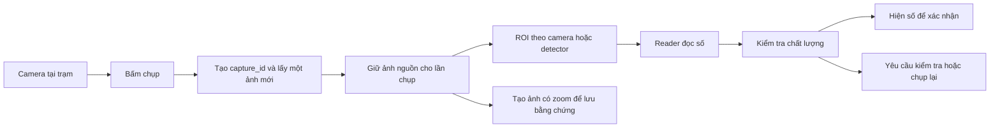
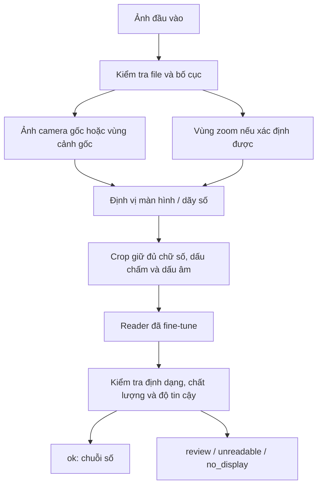

**Kế hoạch huấn luyện đọc số cân từ ảnh — Google Colab + Google Drive + Git**

Ngày lập: 27/09/2026. Dữ liệu khảo sát: `cloudinary_backup_2026-09-27`.

Yêu cầu đã xác nhận: đọc số hiển thị trên cân trong từng ảnh; hỗ trợ cả ảnh camera gốc và ảnh ghép có phần phóng to màn hình. Không suy ra khối lượng từ hình dáng sản phẩm. Đầu ra cần giữ chính xác chữ số, dấu thập phân và dấu âm nếu có.

Luồng sử dụng đã xác nhận thêm: **camera gắn tại trạm → người dùng bấm nút chụp → hệ thống tạo ảnh như backup → đọc số từ ảnh đó**. Camera cung cấp hình ảnh; tác vụ chính là đọc số cho từng lần chụp. Chưa kiểm tra code ứng dụng chụp, nên chưa biết vùng zoom được tạo từ cùng frame như thế nào, độ trễ camera hay giao thức kết nối camera.

Đề xuất: xây pipeline **lấy đúng ảnh của lần chụp → xác định vùng màn hình → nhận dạng chuỗi → kiểm tra chất lượng → trả số hoặc yêu cầu kiểm tra lại**. Với camera có góc cố định, thử ROI đã hiệu chỉnh cho từng camera và reader PP-OCRv5 fine-tune trước; so sánh với YOLO pretrained để định vị khi góc/bố cục thay đổi. So sánh reader với CRNN chuyên chữ số và bộ đọc bảy đoạn. Chọn bằng kết quả trên dữ liệu giữ riêng, không chọn theo tên model hay kích thước model.

Code chuẩn bị dữ liệu, công cụ gán nhãn local và ba notebook Colab hiện nằm trong `scale-ocr/`. Đã sinh index 9.260 ảnh, split sơ bộ (train 5.387; val 1.954; test 1.715; exclude 204) và danh sách pilot 400 ảnh. Chưa có bộ nhãn đã duyệt, chưa train, chưa đo accuracy. Các ngưỡng, số lượng nhãn và siêu tham số dưới đây là điểm bắt đầu đề xuất. Hướng dẫn thao tác ở [COLAB_GUIDE.md](COLAB_GUIDE.md).

**1. Dữ liệu hiện có và hệ quả đối với việc train**

Đã đọc manifest, báo cáo backup, kiểm tra metadata, giải mã 9.260 ảnh `roll-captures`, tính SHA-256 từng ảnh và xem ảnh đại diện của các nhóm camera.

| Nội dung | Kết quả kiểm tra |
|---|---:|
| Tổng tệp media trong backup | 9.458 |
| Tổng dung lượng media theo manifest | 3.592.116.387 byte, khoảng 3,59 GB |
| ZIP hiện có | 3.607.981.295 byte, khoảng 3,61 GB |
| Ảnh thuộc `roll-captures` | 9.260 |
| `core-weight` | 3.805 |
| `product-weight` | 3.770 |
| `photo-draft` | 1.684 |
| Một đường dẫn thử nghiệm khác trong `roll-captures` | 1 |
| Nội dung tệp khác nhau theo SHA-256 trong `roll-captures` | 8.397 |
| Bản trùng vượt quá một đại diện mỗi nội dung | 863, thuộc 680 nhóm trùng |
| Ảnh gần đen theo phép kiểm tra sơ bộ | 77 |
| Lỗi không giải mã được ảnh trong lần quét | 0 |
| Khoảng ngày trong đường dẫn của ảnh cân | 21–27/09/2026 |
| Nhãn số cân/bounding box trong manifest | Không có |

“Gần đen” ở đây là trung bình mức xám dưới 5/255 sau khi thu nhỏ ảnh về 80×60. Đây là tín hiệu để rà soát, không phải kết luận tự động rằng mọi ảnh đó không đọc được. Một màn hình nhỏ sáng trên nền tối vẫn có thể mang thông tin. Việc file giải mã được cũng không chứng minh ảnh có số cân hợp lệ.

| Nguồn | Số ảnh | Nhận xét |
|---|---:|---|
| `gateway-01` | 3.467 | Có màn hình LED đỏ; mẫu đã xem có khung zoom phía dưới |
| `gateway-02` | 4.177 | Góc chéo, màn hình nằm bên phải; có cả ảnh không có khung zoom |
| `gateway-04` | 1.434 | Có phản sáng và lớp nhựa trước màn hình; ảnh nháp có trường hợp bị tay che |
| `gateway-03` | 5 | Quá ít để kết luận chất lượng theo camera |
| `station-01` | 176 | Chỉ bốn nội dung khác nhau; đại diện là ảnh đen và ảnh QR, không có màn hình cân để đọc |
| Đường dẫn thử nghiệm | 1 | Cần loại khỏi tập đọc số nếu không đúng nghiệp vụ |

Các ảnh ngoài `roll-captures` gồm ảnh nhân sự, ảnh mẫu và video mẫu. Không nhập toàn bộ backup vào tập train. Bốn video trong backup là video mẫu Cloudinary, không phải chuỗi video cân để huấn luyện đọc theo thời gian.

Tên `core-weight` và `product-weight` chỉ mô tả loại ảnh, không phải nhãn giá trị. Trong manifest không có `context`, `metadata` hay `tags` cung cấp đáp án số cân. Nếu hệ thống nghiệp vụ có database lưu số đã nhập, có thể dùng để đối chiếu, nhưng phải xác minh đó là số đúng và khớp đúng thời điểm ảnh; số do OCR cũ tạo ra không tự động trở thành ground truth.

Phần lớn ảnh là 1600×1266; 245 ảnh là 1600×900. Trong các mẫu đã xem, phần cảnh gốc nằm phía trên và vùng zoom nằm phía dưới. Không được suy ra mọi ảnh cao hơn 900 pixel đều có cùng bố cục: còn nhiều kích thước khác và cả ảnh 2400×1600.

**2. Định nghĩa “độ chính xác cao nhất” thành chỉ tiêu đo được**

Ưu tiên đúng toàn bộ số cân. Đọc `13.04` thành `13.40`, `1304` hoặc `13.0` đều là lỗi nhận dạng chuỗi. Nếu chỉ báo cáo đúng từng ký tự, kết quả có thể che giấu nhiều ảnh đọc sai cả số.

| Chỉ tiêu | Cách tính/ý nghĩa |
|---|---|
| Exact match trên ảnh đọc được | Số ảnh trả đúng toàn bộ chuỗi / tổng ảnh được người gán nhãn xác nhận đọc được; ảnh bị từ chối vẫn tính là chưa đọc đúng |
| Độ đúng trong số kết quả tự động chấp nhận | Số kết quả `ok` đúng / tổng kết quả `ok`; tự chấp nhận một ảnh không có số đọc được là lỗi |
| Coverage toàn bộ đầu vào | Số ảnh trả `ok` / toàn bộ ảnh đầu vào, gồm cả ảnh đen hoặc không có màn hình |
| Coverage trên ảnh đọc được | Số ảnh đọc được trả `ok` / tổng ảnh đọc được |
| Lỗi dấu thập phân/dấu âm | Đo riêng vì có thể làm giá trị sai rất lớn |
| False accept trên ảnh không đọc được | Số ảnh không đọc được nhưng vẫn trả `ok` / tổng ảnh không đọc được |
| CER | Khoảng cách chỉnh sửa ký tự / tổng ký tự nhãn; dùng tìm lỗi, không thay thế exact match |
| Sai số giá trị | MAE, sai số lớn nhất và lỗi gấp 10/100; tính bằng Decimal, không dùng làm tiêu chí duy nhất |
| Tốc độ | Độ trễ p50/p95, đo trên thiết bị sẽ chạy thực tế |

Mục tiêu đề xuất cho giai đoạn đầu: exact match ≥99% trên ảnh đọc được ở tập test theo thời gian. Mục tiêu vận hành tiếp theo: ≥99,9% đúng trong các kết quả được tự động chấp nhận, đồng thời coverage đủ dùng. Mức coverage 90–95% có thể dùng làm mục tiêu thảo luận ban đầu, nhưng phải đặt lại sau khi biết tỷ lệ ảnh vốn không thể đọc. Đây là mục tiêu, không phải cam kết đạt được từ backup hiện tại.

Phải công bố số mẫu, số lỗi và khoảng tin cậy. Với n quan sát độc lập và không có lỗi, cận trên một phía 95% của tỷ lệ lỗi là `1 - 0.05**(1/n)`. Khoảng 3.000 kết quả được chấp nhận, độc lập, không lỗi mới hỗ trợ cận trên xấp xỉ 0,1%. Vài trăm ảnh đạt 100% chưa chứng minh hệ thống đạt 99,9% ngoài thực tế. Hai crop từ cùng ảnh và nhiều lần chụp cùng phiên không phải các quan sát độc lập. Khi có nhiều ảnh/phiên, tính khoảng tin cậy theo nhóm phiên, chẳng hạn bootstrap theo phiên.

**3. Pipeline đề xuất cho hai dạng ảnh**

Luồng tích hợp vào thao tác chụp của trạm:



Mỗi lần bấm tạo một `capture_id`. Kết quả OCR phải gắn đúng ID và đúng ảnh nguồn, không đọc lại frame khác rồi ghép vào kết quả cũ. Ảnh cảnh gốc, crop đưa vào OCR và ảnh có zoom nên được tạo từ cùng ảnh nguồn; xác minh điều này trong code ứng dụng trước khi tích hợp. Nếu ứng dụng hiện chỉ cung cấp ảnh ghép, pipeline vẫn đọc ảnh ghép và truy vết về ID của lần chụp.

OCR có thể chạy trên frame nguồn trước khi ghép khung zoom, giúp kiểm soát rõ crop và hạn chế các lần resize/nén không cần thiết. Nếu giữ luồng ảnh ghép hiện tại, train và test đúng đầu vào đó. Cả hai đường đi phải được kiểm tra trên cùng điều kiện camera thực tế.

Phân biệt hai cấp ID: `event_key` là phiên cân/sản phẩm, có thể bao gồm core, product và nhiều lần chụp lại; `capture_id` là một lần bấm. Các lần chụp lại trong cùng phiên vẫn phải nằm trong cùng split. Metadata lịch sử chưa đủ tách chính xác từng lần bấm thì giữ nhóm phiên lớn hơn; không tự tạo ra timestamp chụp từ thời gian upload.

Trong giai đoạn vận hành thử, sau khi bấm chụp, giao diện hiện ảnh/crop và số dự đoán; người dùng xác nhận hoặc sửa. Lưu riêng số model dự đoán và số người dùng xác nhận để đo lỗi. Khi model từ chối, để giá trị trống và hiển thị lý do ngắn như “màn hình bị che” hoặc “không rõ dấu thập phân”; người dùng có thể kiểm tra hoặc chụp lại. Không điền mặc định bằng 0 hoặc số của lần cân trước.

Nếu người dùng chụp lại khi yêu cầu cũ còn chạy, phản hồi cũ không được ghi đè ảnh/số mới trên giao diện. Cần đối chiếu `capture_id` ở cả phía xử lý và phía hiển thị, đồng thời đo tổng độ trễ từ bấm chụp tới nhận kết quả.

Luồng đọc bên trong một ảnh:



Đối với ảnh camera gốc, bộ định vị phải hoạt động độc lập, không cần khung zoom. Đối với ảnh ghép, có thể tận dụng cả màn hình trong cảnh gốc lẫn vùng zoom. Nếu hai vùng cho kết quả khác nhau, chuyển `review` trừ khi đã có quy tắc chọn vùng được kiểm chứng trên validation. Nếu hai vùng bắt nguồn từ cùng pixel thì không được coi là hai bằng chứng độc lập; nguồn tạo vùng zoom cần được xác minh trong ứng dụng.

Nhánh xử lý bố cục phải có fallback: nếu không nhận ra khung zoom, chạy detector trên toàn ảnh. Trong ảnh có hai bản của màn hình, cần xác định chúng thuộc cùng một nguồn số; không trả nhầm hai cân khác nhau. Nếu ảnh chứa nhiều cân thật và chưa có quy tắc chọn cân đích, trả `review`.

ROI cố định theo camera là ứng viên đầu tiên khi góc máy được giữ ổn định. Hiệu chỉnh bằng cách vẽ vùng bao đủ toàn màn hình số, kiểm tra trên nhiều lần chụp thực tế rồi lưu theo `camera_id`, kích thước ảnh và phiên bản cấu hình. Crop thực tế có thể thu hẹp tiếp để reader chỉ nhìn thấy dãy số. Nếu reader có kết quả tốt với ROI này, chưa cần train detector chỉ để đáp ứng một kiến trúc định trước.

So sánh ba cách định vị trên cùng validation: ROI đã hiệu chỉnh, detector toàn ảnh, và ROI có detector dự phòng. Đưa vào các trường hợp camera lệch góc hoặc thay đổi kích thước ảnh. Cơ chế chọn đường đi phải được kiểm tra, vì reader tự tin không chứng minh ROI đang trỏ đúng màn hình. Camera bị di chuyển cần hiệu chỉnh lại hoặc dùng detector đã nghiệm thu. Không hardcode một tọa độ cho tất cả ảnh.

**4. Thuật toán và thứ tự thử nghiệm**

| Phương án | Điểm phù hợp | Điểm cần kiểm chứng | Vai trò |
|---|---|---|---|
| ROI + xử lý ảnh bảy đoạn | Màn hình LED, camera cố định, dễ kiểm tra nguyên nhân lỗi | Lóa, mất nét, thiếu đoạn do thời điểm chụp, dấu chấm nhỏ | Baseline và bộ đọc đối chiếu |
| ROI + OCR pretrained | Có kết quả nhanh với ít công xây dựng | OCR chữ in thông thường có thể đọc LED sai | Đo baseline trước fine-tune |
| ROI theo camera + PP-OCRv5 fine-tune | Phù hợp camera gắn cố định; giảm bước xử lý | ROI lệch khi camera dịch chuyển; phải hỗ trợ cả bố cục raw và ghép | Phương án ưu tiên thử cho trạm hiện tại |
| YOLO + PP-OCRv5 fine-tune | Tách được lỗi tìm màn hình và lỗi đọc số; tận dụng pretrained | Phải gán nhãn và dùng crop đúng miền dữ liệu | So sánh khi ROI không ổn định hoặc có nhiều góc máy |
| YOLO + CRNN/CTC chuyên số | Từ vựng nhỏ, chuỗi ngắn, có thể tạo nhiều dữ liệu LED tổng hợp | Cần triển khai/huấn luyện reader và kiểm tra CTC | Đối thủ so sánh quan trọng |
| CNN đọc từng vị trí + đầu dự đoán dấu chấm | Hữu ích khi một loại cân có số vị trí cố định | Nhiều loại màn hình, vị trí trống, số chữ số thay đổi | Thử riêng cho camera/loại cân cố định |
| Detector từng chữ số rồi sắp trái sang phải | Dễ xem chữ số nào bị bỏ sót | Gán nhãn tốn công; dấu chấm rất nhỏ; dễ bỏ/đếm lặp | Thử nếu lỗi nhận dạng chuỗi vẫn lớn |
| Ensemble hai reader | Có thể tăng chất lượng nếu lỗi khác nhau | Tăng độ trễ; đồng ý vẫn có thể cùng sai | Chỉ giữ khi validation chứng minh có ích |

Không chọn hồi quy một số thực làm baseline chính: mục tiêu là đọc chính xác chuỗi hiển thị, và sai dấu thập phân phải được nhìn thấy rõ. Cũng không tạo một class cho mỗi giá trị như `7.04`, `7.05`: phương án đó khó xử lý những giá trị chưa xuất hiện trong tập train.

YOLO chỉ cần class `weight_display` hoặc `weight_digits`, tùy quy ước bbox đã chọn. Không dùng `core-weight`/`product-weight` làm class detector. Chọn một quy ước và áp dụng nhất quán. Nên bắt đầu bbox bao toàn bộ dãy số và các ký hiệu liên quan, có margin đủ nhỏ để không mất dấu chấm.

Ultralytics hỗ trợ train detector từ pretrained và định dạng dataset YOLO. Ví dụ trong hướng dẫn Colab dùng `yolo26s.pt`; đây là ứng viên ban đầu, không phải khẳng định nó chính xác nhất cho dữ liệu này. So sánh model nhỏ và vừa sau khi giữ nguyên bộ dữ liệu/đánh giá. [Tài liệu detection](https://docs.ultralytics.com/tasks/detect).

PP-OCRv5 là reader ứng viên để fine-tune. Bắt đầu bằng model có sẵn, giữ dictionary/head tương thích để tận dụng pretrained. Khi thử alphabet riêng `0123456789.-`, phải điều chỉnh lại đầu ra và bộ giải mã; không chỉ sửa file dictionary rồi giả định checkpoint cũ vẫn tương thích. [Hướng dẫn nhận dạng và fine-tune PaddleOCR](https://github.com/PaddlePaddle/PaddleOCR/blob/main/docs/version3.x/module_usage/text_recognition.en.md).

CRNN dùng CNN trích đặc trưng ảnh, mạng xử lý chuỗi và CTC để học từ nhãn cả chuỗi, không cần vẽ bbox từng ký tự. Ví dụ crop → đặc trưng theo chiều ngang → BiLSTM → xác suất ký tự → CTC decode. CTC có token blank và quy tắc xử lý ký tự lặp; phải kiểm tra kỹ các chuỗi như `0.00`, `11.11`, `100.00`. [Bài báo CRNN](https://arxiv.org/abs/1507.05717), [PyTorch CTCLoss](https://docs.pytorch.org/docs/stable/generated/torch.nn.CTCLoss.html).

Bộ đọc bảy đoạn có thể gồm: làm rõ màu LED → hiệu chỉnh góc nhìn → tìm vị trí ký tự → đo độ sáng bảy vùng a–g → tra bảng 0–9; dấu chấm và dấu âm có logic riêng. Với `8`, cả bảy đoạn sáng; `1` chủ yếu hai đoạn bên phải. Ngưỡng cần được hiệu chỉnh theo dữ liệu train/validation, không lấy màu đỏ hoặc vị trí ký tự cố định cho mọi camera. Không dùng xử lý hình thái quá mạnh làm dính hoặc xóa dấu chấm.

**5. Chuẩn bị dữ liệu và chống rò rỉ**

Giữ nguyên backup gốc. Tạo index ánh xạ từ `asset_id` sang `public_id` và `local_file`; tên file local đã được đổi thành asset ID nên không thể đoán camera từ tên JPG.

Hai dạng đường dẫn đã thấy:

```text
roll-captures/{gateway}/{yyyy}/{mm}/{dd}/core-weight/{event_uuid}
roll-captures/{gateway}/{yyyy}/{mm}/{dd}/product-weight/{event_uuid}
roll-captures/{gateway}/{yyyy}/{mm}/{dd}/photo-draft/{event_uuid}/{slot}/{image_uuid}
```

Trong nhánh ảnh nháp, UUID cuối là ID ảnh, không phải ID phiên. ID phiên nằm ngay sau `photo-draft`. Backup có 3.805 ID phiên ở ảnh đã lưu, 800 ID phiên ảnh nháp, trong đó 658 ID xuất hiện ở cả hai nhóm. Có 3.770 cặp `core-weight` + `product-weight` và 35 phiên chỉ có ảnh `core-weight` trong nhánh đã lưu.

Trình tự xử lý:

1. Lọc đúng `roll-captures`; đưa đường dẫn không đúng schema vào danh sách rà soát.
2. Giải mã ảnh, kiểm tra kích thước; gắn cờ ảnh đen, QR thử nghiệm, không thấy cân, bị che, lóa hoặc nhòe.
3. Tính SHA-256 để nhận biết file trùng hoàn toàn. Giữ một đại diện khi huấn luyện và giữ bảng mọi bản gốc cho truy vết.
4. Tạo `event_key = gateway + ':' + event_uuid`, liên kết ảnh nháp và ảnh đã lưu.
5. Liên kết các phiên có ảnh thực trùng nội dung để không đưa cùng nội dung vào nhiều tập.
6. Rà ảnh gần trùng trong cùng camera/khoảng thời gian; dùng hash hoặc embedding làm ứng viên rồi kiểm tra vùng số.
7. Chia tập trước khi tạo crop, resize, augmentation hoặc ảnh tổng hợp từ ảnh thật.

Không dùng pHash toàn cảnh để xóa tự động: cảnh camera thường gần như không đổi trong khi chỉ vài chữ số thay đổi. Cũng không loại hai ảnh chỉ vì chúng có cùng số cân. Cùng số có thể xuất hiện hợp lệ ở nhiều điều kiện khác nhau.

Ảnh placeholder đen/QR lặp lại ở nhiều phiên phải được tách riêng trước khi nối nhóm theo nội dung, nếu không một ảnh đen có thể nối hàng trăm phiên thành một nhóm lớn. Dùng các đại diện này làm dữ liệu âm cho bộ kiểm tra đầu vào; không cho cùng template xuất hiện ở cả train và test. Tập kiểm tra ảnh không đọc được cần thêm ảnh âm thực tế mới, không được chỉ đo trên cùng vài placeholder.

Giữ ảnh khó đọc trong danh mục dữ liệu và tập đánh giá trạng thái. Chỉ bỏ chúng khỏi loss đọc chuỗi khi không có nhãn đọc được. Nếu loại mọi ảnh khó rồi báo “accuracy toàn hệ thống”, kết quả sẽ không đại diện đầu vào thực tế.

**6. Gán nhãn đúng ngay từ đầu**

Đợt pilot: 300–500 ảnh đa dạng để thống nhất cách gán nhãn và biết loại lỗi. Sau đó mở rộng tới khoảng 1.000–2.000 ảnh có vị trí màn hình được duyệt, rồi tăng lên toàn bộ ảnh đọc được có giá trị sau khử trùng. Các con số là mốc triển khai, không phải điều kiện đảm bảo accuracy.

Lấy mẫu từ tất cả camera hữu ích, ngày, core/product/draft, ảnh gốc/ghép, dải giá trị và điều kiện ánh sáng. Chủ động đưa vào ảnh 0, nhiều chữ số lặp, dấu chấm khó thấy, hàng chục/hàng trăm nếu có, LED lóa, màn hình nghiêng, bị che và không có màn hình. Không lấy ngẫu nhiên một lô chỉ toàn ảnh rõ.

Dùng công cụ gán nhãn có bbox và thuộc tính text, chẳng hạn CVAT. Với mỗi vùng số, vẽ bbox và nhập chuỗi hiển thị. Lưu export gốc có cả thuộc tính; export YOLO chỉ chứa class/bbox không đủ để lưu nhãn OCR. Chuẩn hóa sang JSONL rồi sinh riêng dataset detection và recognition.

| Trường nhãn | Quy ước |
|---|---|
| `asset_id`, `public_id`, `source_path`, `sha256` | Truy vết file gốc |
| `event_key`, `group_id` | Phiên và nhóm dùng chia tập |
| `capture_id`, `camera_id`, `captured_at`, `camera_config_version` | Thêm cho dữ liệu mới: lần bấm, camera thật, thời điểm ảnh và cấu hình; không giả định gateway luôn tương ứng đúng một camera |
| `gateway`, `path_date`, `uploaded_at` | Metadata; giờ upload không tự động là giờ chụp |
| `layout` | `raw`, `composite`, `unknown` |
| `parent_asset_id`, `view_id` | Liên kết crop với ảnh cha |
| `view_kind` | `scene`, `zoom`, `full` |
| `bbox_xyxy` | Pixel trên đúng ảnh/view đã ghi kích thước; x2,y2 là biên phải/dưới |
| `corners` | Bốn góc theo thứ tự thống nhất nếu cần hiệu chỉnh phối cảnh |
| `display_text` | Chuỗi nhìn thấy, ví dụ `7.04`; lưu dạng string |
| `readability` | `readable`, `partial`, `unreadable`, `no_display`, `non_numeric` |
| `reason` | `black`, `occluded`, `blur`, `glare`, `clipped`, `ambiguous_decimal`, v.v. |
| `annotator`, `reviewer`, `review_status`, `label_version` | Kiểm soát chất lượng nhãn |
| `split` | Đọc từ file split cố định, không chọn lại mỗi lần train |

Quy tắc bắt buộc khi gán nhãn:

1. Đọc đúng thứ nhìn thấy. `0.00` là số hợp lệ, ảnh đen không có nhãn `0.00`.
2. Giữ dấu thập phân, dấu âm, số 0 đầu/cuối nếu màn hình thực sự hiển thị chúng. Không mặc định mọi cân có hai chữ số thập phân.
3. Không nhìn nhãn sản phẩm/QR để suy ra số màn hình. Nhãn trên bao bì có thể là khối lượng danh định khác số cân thực tế.
4. Khi một ký tự hoặc dấu chấm không chắc, gắn `partial`/`unreadable`; không đoán để có đủ nhãn.
5. Nếu số đang đổi, có đoạn LED bị thiếu hoặc hai vùng ảnh mâu thuẫn, ghi lý do và chuyển người duyệt. Một ảnh đơn lẻ thường không đủ để xác nhận cân đang ổn định.
6. Bbox phải giữ đủ dấu âm/chấm và mọi chữ số. Ảnh có vùng zoom và cảnh gốc cần nhãn cho cả hai vùng nhìn thấy nếu dùng cả hai để train.
7. Nếu người duyệt đọc được nhờ zoom nhưng vùng gốc không thể đọc, không gán nhãn “readable” cho crop gốc chỉ vì biết đáp án từ zoom.
8. Validation/test cần hai lượt đọc độc lập và xử lý bất đồng. Với train, duyệt toàn bộ nhãn pseudo-label trước khi coi là nhãn chuẩn; tăng kiểm tra ở ảnh khó.

Có thể dùng model để điền nháp bbox/text, sau đó người duyệt sửa. Ở tập đánh giá quan trọng, người đọc đầu tiên nên nhập độc lập trước khi xem dự đoán để giảm xu hướng làm theo model.

**7. Tạo ảnh train phù hợp cả đầu vào gốc và ảnh ghép**

Với layout đã xác minh, tách phần cảnh gốc và phần zoom thành hai view. Cả hai vẫn dùng cùng `parent_asset_id`, `event_key`, `group_id`, `split`. Phần cảnh gốc cắt từ ảnh ghép giúp tập train gần đầu vào camera gốc, nhưng vẫn cần lấy thêm ảnh camera gốc thật để kiểm tra khác biệt về nén, độ phân giải và pipeline chụp. Với hệ thống bấm chụp hiện tại, nên lưu thêm frame nguồn ở những lần chụp mới dùng thu dữ liệu; ảnh nguồn và ảnh ghép phải có cùng `capture_id`.

Detector học trên scene/full và zoom view. Nếu train trên toàn ảnh ghép thay vì tách view, phải annotate mọi vùng số mục tiêu nhìn thấy, tránh để một vùng số thật trở thành vùng không nhãn. Nếu cân bị che mà vẫn định vị được màn hình, có thể dùng bbox cho detection nhưng loại crop đó khỏi loss OCR.

Reader học trên crop dãy số. Thử margin 5–10%, giữ tỉ lệ ảnh và pad thay vì kéo méo. Điểm xuất phát cho model tương thích là ảnh cao 48 pixel, rộng tối đa 320; so sánh thêm chiều cao 64 nếu dấu chấm quá nhỏ. Khi đổi shape phải đổi đồng bộ train, validation, export và inference.

Giữ RGB/BGR theo đúng preprocessing model. Thử nhánh ảnh xám, CLAHE hoặc mask màu LED như ablation. Không thay ảnh gốc bằng threshold cứng trong mọi trường hợp. Hiệu chỉnh phối cảnh bằng bốn góc chỉ giữ lại nếu cải thiện thực tế; góc ước lượng sai có thể làm méo chữ số.

Không kỳ vọng tăng độ phân giải hoặc ảnh sinh làm xuất hiện thông tin đã bị che. Không dùng super-resolution tạo sinh như nguồn ground truth.

**8. Chia train / validation / test theo thời gian và phiên**

Đề xuất split ban đầu cho snapshot này:

| Tập | Ngày trong đường dẫn | Số ảnh trước lọc/khử trùng |
|---|---|---:|
| Train | 21–24/09/2026 | 5.528 |
| Validation | 25/09/2026 | 2.012 |
| Test khóa lại | 26–27/09/2026 | 1.719 |
| Đường dẫn thử nghiệm không có ngày đúng schema | Rà soát riêng | 1 |

Các số trên chưa phải số mẫu train cuối cùng. Sau khi xử lý placeholder, ảnh trùng, nhóm phiên vượt ranh giới ngày và nhãn không đọc được, số lượng sẽ thay đổi. Ngày đường dẫn là đại diện thời gian có sẵn; nếu lấy được timestamp chụp thật, phải ưu tiên timestamp đó và xác nhận múi giờ.

Không được để một `event_key` hoặc nhóm ảnh thực trùng xuất hiện ở hai tập. Nếu nhóm vượt ranh giới thời gian, giữ mẫu ở cửa sổ đánh giá muộn hơn và loại các bản liên quan khỏi train/validation trước đó; hoặc cách ly cả nhóm nếu chưa rõ. Không chuyển ảnh chụp sau cutoff vào train cho đủ tỷ lệ.

Ngày 27 không có dữ liệu `gateway-04`, nên chỉ dùng riêng ngày 27 làm test sẽ thiếu camera này. Giữ cả ngày 26 giúp đánh giá `gateway-04`; vẫn phải công bố số mẫu theo camera. `gateway-03` có năm ảnh, chưa có cơ sở nghiệm thu camera này.

Validation dùng chọn model/siêu tham số. Tách một phần theo nhóm của validation để hiệu chỉnh ngưỡng chấp nhận, hoặc thu thêm tập calibration riêng. Không đặt ngưỡng trên test. Test chỉ mở khi đã chốt model và ngưỡng. Nếu thay model vì quan sát lỗi test, tập đó trở thành tập phát triển; cần test mới để kết luận cuối.

`GroupShuffleSplit` có thể dùng cho pilot khi chưa có đủ dữ liệu theo thời gian, nhưng tỷ lệ của nó áp dụng theo nhóm và không tự giải quyết trôi dữ liệu theo ngày. [Tài liệu GroupShuffleSplit](https://scikit-learn.org/stable/modules/generated/sklearn.model_selection.GroupShuffleSplit.html).

Cần thêm hai phép đánh giá: thử giữ riêng một camera để đo khả năng chuyển camera, và test tương lai sau ngày backup trên ảnh gốc lẫn ảnh ghép. Không dùng kết quả camera đã thấy trong train để tuyên bố hoạt động tốt ở camera mới.

**9. Augmentation và dữ liệu tổng hợp**

| Biến đổi | Thiết lập bắt đầu đề xuất |
|---|---|
| Độ sáng/contrast/gamma | Nhẹ đến vừa, khớp ảnh thực |
| JPEG/noise/blur | Có mức nhẹ; xem trực tiếp crop sau biến đổi |
| Rotation/perspective | Góc nhỏ, không cắt mất chữ hoặc dấu chấm |
| Crop jitter | Dịch bbox nhẹ, giữ nguyên toàn bộ target |
| Resize/downsample | Mô phỏng số nhỏ trên ảnh gốc, vẫn phải đọc được |
| Flip ngang/dọc | Tắt |
| Mosaic/MixUp trên crop OCR | Tắt |
| Che khuất/xóa đoạn chữ số | Không giữ nguyên nhãn nếu làm ảnh trở nên mơ hồ; đưa sang nhánh kiểm tra chất lượng |

Sau baseline ảnh thật, thử sinh 50.000–100.000 crop LED bảy đoạn bằng code: số chữ số đa dạng, số lặp, dấu chấm ở vị trí hợp lệ, dấu âm nếu nghiệp vụ có, nền và độ nghiêng khác nhau. Dữ liệu tổng hợp chỉ bổ sung train, không vào validation/test.

Thử tỷ lệ synthetic 0%, 20%, 40% trong batch rồi fine-tune thêm với ảnh thật. Không trộn quá nhiều ảnh tổng hợp rõ nét khiến model ưu tiên font nhân tạo. Không dùng nền/crop từ test để sinh dữ liệu. Render số theo quy tắc, không dùng model sinh ảnh làm chuẩn cho đáp án chữ số.

**10. Tham số khởi đầu và cách train**

| Thành phần | Điểm bắt đầu đề xuất |
|---|---|
| Detector | Pretrained loại nhỏ; 1 class; imgsz 960 hoặc 1024 |
| Detector batch | 4–8 trước, tăng theo VRAM thực tế |
| Detector lịch train | Tối đa 100 epoch, patience khoảng 20; lưu best/last |
| Detector augmentation | Flip 0, mosaic 0 cho baseline, scale/rotation nhẹ |
| Reader pretrained | PP-OCRv5 server; so sánh mobile nếu tài nguyên/độ trễ yêu cầu |
| Reader batch | 16–32 trước; kiểm tra cả sampler và loader trong config |
| Reader learning rate | Thử 3e-5 và 1e-4 khi fine-tune; không mặc định LR của train quy mô lớn |
| Reader lịch train | 30–80 epoch ban đầu, chọn checkpoint theo validation exact match |
| Reader ảnh | Bắt đầu shape tương thích pretrained, thí dụ 3×48×320 |
| CRNN tự triển khai | Alphabet số + dấu cần thiết + blank; AdamW; LR được tune riêng với backbone/head |
| Seed | Giữ cố định split; chạy 3 seed cho một hoặc hai cấu hình cuối |

Các tham số này không phải cấu hình tối ưu đã tìm được. Giảm batch khi thiếu VRAM; ghi rõ effective batch nếu dùng tích lũy gradient. Mixed precision phải được kiểm tra với loss của framework, nhất là CTC; không bật mọi tối ưu cùng lúc trước khi baseline chạy đúng.

Trước train dài, kiểm tra model overfit được một tập nhỏ 32–64 crop train đã duyệt, tắt augmentation. Nếu không học được, kiểm tra nhãn, dictionary, shape, kênh màu, loss và checkpoint. Bài kiểm tra này phục vụ debug, không đo khả năng tổng quát hóa.

Reader phải được đánh giá hai cách: crop chuẩn do người gán nhãn và crop do detector dự đoán. Nếu chỉ đo crop chuẩn, kết quả chưa phản ánh lỗi cắt mất dấu chấm ngoài thực tế. Ở giai đoạn sau, thêm crop do detector tạo trên train và crop jitter; bảo đảm nhãn vẫn nhìn thấy đầy đủ. Có thể tạo crop train theo cross-validation để mô phỏng lỗi detector trên ảnh nó chưa học.

**11. Ma trận thí nghiệm để tìm cấu hình tốt**

| Run | Cấu hình | Điều cần biết |
|---|---|---|
| R0 | ROI đã kiểm tra + OCR pretrained | Baseline chưa fine-tune |
| R1 | Bộ đọc bảy đoạn trên cùng crop | LED có đủ rõ cho logic chuyên biệt không |
| R2 | Crop chuẩn + PP-OCRv5 fine-tune | Trần chất lượng của reader khi crop đúng |
| R3a | ROI theo camera + reader R2 | Chất lượng toàn pipeline cho camera gắn cố định |
| R3b | YOLO + reader R2; thêm biến thể ROI có fallback | Detector có thực sự cải thiện so với R3a không |
| R4 | YOLO + CRNN chuyên số | Kiến trúc chuyên số có giảm lỗi không |
| R5 | Cấu hình tốt + synthetic | Synthetic có cải thiện ảnh khó thật không |
| R6 | Cấu hình tốt + khai thác lỗi train/val | Nhãn bổ sung có giảm lỗi còn lại không |
| R7 | Hai reader hoặc hai view + ngưỡng chấp nhận | Độ đúng/coverage/độ trễ có tốt hơn không |

Giữ nguyên split khi so sánh. Mỗi lần thay một yếu tố chính. Xuất bảng lỗi gồm ảnh, crop, nhãn, dự đoán, loại lỗi, camera, ngày và độ tin cậy. Chia lỗi thành tìm sai vùng, crop thiếu, chữ số nhầm, dấu chấm, ảnh vốn không đọc được, nhãn sai và lỗi hậu xử lý. Sửa nguyên nhân chiếm tỷ lệ lớn nhất trước khi tăng model.

Active learning: lấy ảnh mới mà model thiếu tự tin, hai reader bất đồng, dấu chấm mơ hồ hoặc camera/bố cục mới; người gán nhãn xác nhận rồi thêm vào phiên bản train tiếp theo. Không lấy test khóa lại làm kho ảnh để khai thác lỗi và tiếp tục gọi nó là test.

**12. Hậu xử lý và cơ chế từ chối**

Giữ riêng `raw_text` và chuỗi chuẩn hóa. Chỉ chuẩn hóa những quy tắc đã chốt, ví dụ bỏ khoảng trắng ngoại vi. Không tự sửa `704` thành `7.04` chỉ vì thường thấy hai số lẻ. Nếu dấu thập phân bị mất và không có bằng chứng đủ mạnh, trả `review`.

Không dùng trọng lượng danh định của sản phẩm để ghi đè kết quả. Kiểm tra khoảng giá trị và độ chia theo cấu hình cân có thể phát hiện bất thường, nhưng không được ép kết quả thành một giá trị gần đó. Đơn vị chỉ điền khi có metadata hoặc ký hiệu được xác nhận; ảnh chỉ có số không chứng minh đơn vị là kg.

Confidence do OCR trả về không tự động là xác suất đúng toàn bộ số. Không nhân confidence detector và reader rồi gọi đó là độ chính xác. Dùng tập calibration để chọn ngưỡng theo tỷ lệ lỗi thực tế; khi đủ dữ liệu có thể hiệu chỉnh bằng logistic regression trên đặc trưng như score thấp nhất, score trung bình, chất lượng crop và mức bất đồng.

Ví dụ hợp đồng đầu ra đề xuất, các số confidence chưa được điền vì chưa có hiệu chỉnh:

```json
{
  "capture_id": "example-capture-001",
  "status": "ok",
  "raw_text": "7.04",
  "display_text": "7.04",
  "numeric_value": "7.04",
  "unit": null,
  "calibrated_probability": null,
  "source_view": "scene",
  "model_version": "scale-ocr-v001",
  "reason": null
}
```

Với ảnh không đọc được: `status = unreadable`, giá trị số bằng `null`, kèm lý do. Với ảnh không có màn hình: `no_display`. Với kết quả mâu thuẫn hoặc ngoài điều kiện đã nghiệm thu: `review`. Lưu string/Decimal để không mất định dạng `1.00` khi chuyển thành float.

**13. Git, Drive và khả năng tái lập**

Thư mục backup hiện tại chưa phải Git repository và chưa có code train. Nên tạo repo riêng `scale-ocr`, không đưa toàn bộ backup vào Git.

```text
scale-ocr/                         # cấu trúc đề xuất, chưa được triển khai
  README.md
  requirements-detector.lock.txt
  requirements-recognizer.lock.txt
  configs/
    detector.yaml
    recognizer.yaml
    cameras.yaml
    acceptance.yaml
  notebooks/
    01_prepare.ipynb
    02_detector.ipynb
    03_recognizer.ipynb
    04_evaluate.ipynb
  src/scale_ocr/
    inventory.py
    annotations.py
    splits.py
    views.py
    detector.py
    reader.py
    pipeline.py
    evaluate.py
  tests/
  dataset_versions/               # checksum, mô tả nguồn và phiên bản
  reports/                       # báo cáo nhỏ, không chứa toàn bộ ảnh
```

```text
MyDrive/scale-ocr/
  raw/
    cloudinary_backup_2026-09-27.zip
    cloudinary_backup_2026-09-27.zip.sha256
  datasets/v001/
    annotations.jsonl
    split.csv
    dataset.zip
    dataset.zip.sha256
    dataset_card.json
  runs/<run_id>/
    config.yaml
    environment.txt
    metrics.json
    predictions.csv
    checkpoints/
  exports/<model_version>/
```

Git lưu code, cấu hình và định danh dataset. Drive lưu ảnh, nhãn có dữ liệu nghiệp vụ, dataset bundle, checkpoint, dự đoán và model xuất bản. Nếu lưu nhãn nhỏ trong repo thì dùng repo có quyền truy cập phù hợp. Không commit token, `.env`, ZIP, ảnh, checkpoint và notebook output chứa thông tin xác thực.

Mỗi run phải ghi: Git commit của dự án, commit/framework version của model, phiên bản Python/CUDA, GPU, seed, hash dataset/nhãn/split, preprocessing, augmentation, siêu tham số, thời điểm train và metric. Lưu `last` để resume đầy đủ optimizer/scheduler, `best` để chọn model. Không đổi dataset hoặc split rồi gọi đó là tiếp tục cùng run.

Colab nên copy archive từ Drive về `/content`, giải nén và đọc ảnh trên đĩa local. Drive dùng lưu checkpoint/báo cáo định kỳ. Cách này giảm số lần đọc file nhỏ qua Drive; Google cũng hướng dẫn sử dụng archive và giải nén trên VM. [Colab FAQ](https://research.google.com/colaboratory/faq.html).

**14. Nghiệm thu và đưa vào dùng**

Colab là nơi train và thử nghiệm. Sau khi chọn model, triển khai inference vào máy tại trạm hoặc một dịch vụ backend mà ứng dụng chụp gọi tới. Chọn nơi chạy sau khi đo CPU/GPU, độ trễ mạng và yêu cầu thời gian phản hồi; chưa có thông tin phần cứng để chốt. Ứng dụng bấm chụp không nên phụ thuộc vào một phiên Colab đang mở. Git quản lý code, Drive giữ dữ liệu/model; cả hai không tự cung cấp dịch vụ nhận dạng cho trạm.

Chốt model, preprocessing và ngưỡng trên validation/calibration; sau đó chạy test khóa lại. Báo cáo riêng theo camera, raw/composite, có/không có zoom, core/product/draft, ngày, số chữ số, dấu thập phân, độ nghiêng và chất lượng ảnh. Báo cáo số mẫu mỗi nhóm; không dùng một trung bình chung để che nhóm camera ít dữ liệu.

Kiểm tra trên ảnh camera gốc thật thu mới. Nếu chỉ thử raw view cắt từ cùng ảnh ghép trong test, cần ghi rõ đó là phép thử hai cách trình bày của cùng mẫu, không phải thêm nhiều mẫu độc lập.

Sau export, so sánh kết quả model xuất với model gốc trên tập kiểm tra cố định, đặc biệt ảnh dấu chấm nhỏ và chữ số khó. ONNX/FP16/INT8 có thể thay đổi đầu ra; chỉ giữ tối ưu tốc độ khi chênh lệch chất lượng nằm trong tiêu chí đã chốt. Không thay đổi cấu hình inference mà giữ nguyên số phiên bản model.

Chạy thử song song với người kiểm tra trên dữ liệu tương lai trước khi tự động ghi số vào nghiệp vụ. Lấy mẫu kiểm tra cả kết quả `ok`, vì chỉ kiểm tra những ảnh bị từ chối sẽ không phát hiện model tự tin nhưng sai. Theo dõi coverage, lỗi dấu chấm, tỷ lệ review và drift theo camera; thay đổi camera/ánh sáng/loại cân cần đánh giá lại.

Mặc định mỗi lần bấm được đánh giá trên một ảnh như backup. Đây là phạm vi của phiên bản đầu. Khả năng đọc đúng chữ số trong ảnh khác với việc xác nhận cân đã ổn định: nếu màn hình đang thay đổi nhưng một frame vẫn có số rõ, OCR có thể đọc đúng frame đó mà chưa chứng minh đây là số cân cuối cùng.

Một cải tiến tùy chọn sau baseline là mỗi lần bấm lấy một chùm ngắn, thí dụ 3–5 frame trong vài trăm mili giây. Đây là cấu hình thử nghiệm cần đo độ trễ và độ ổn định thực tế. Chỉ đồng thuận giữa các frame khác nhau, cùng lần chụp và cùng trạng thái cân; nếu số thay đổi hoặc màn hình bị che thì yêu cầu chụp lại. Giữ ảnh đã chọn và liên kết kết quả với chính ảnh đó; không lưu ảnh A nhưng trả số chỉ đọc được ở ảnh B. Tất cả frame của chùm nằm trong cùng group/split. Không tính chúng là các quan sát độc lập để chứng minh accuracy.

Backup hiện tại chưa có dữ liệu chuỗi phù hợp để kiểm chứng cải tiến này. Camera đang quay không có nghĩa phần mềm hiện đã lưu chùm frame. Việc đọc trực tiếp ảnh chụp hiện có vẫn là baseline để nghiệm thu.

Ưu tiên cải thiện nguồn ảnh nếu lỗi đến từ vật che, lóa hoặc thiếu nét: cố định camera, lấy nét đúng màn hình, tăng kích thước chữ số trên ảnh, kiểm tra exposure với LED và chụp khi màn hình nhìn rõ. Train thêm không khôi phục được số đã bị che kín.

Trong pilot tại trạm, kiểm tra thêm: frame có mới đúng lúc bấm hay là preview cũ; vùng zoom có cùng frame với cảnh gốc; dấu chấm còn rõ sau nén; ảnh không bị tay che khi bấm; số OCR không bị ghép nhầm sang lần chụp khác. Không đặt một shutter/exposure chung khi chưa biết camera và màn hình cân; chụp thử nhiều lần để kiểm tra tình trạng thiếu đoạn/cháy sáng.

**15. Kế hoạch triển khai theo mốc bàn giao**

| Mốc | Việc làm | Điều kiện hoàn thành |
|---|---|---|
| A — chuẩn hóa dữ liệu và luồng chụp | Index, SHA, phân nhóm, split sơ bộ; xác minh nguồn ảnh/zoom và ID lần chụp | Truy vết được ảnh-số; không có nhóm ảnh thực trùng chéo tập |
| B — nhãn pilot | 300–500 ảnh đa dạng, quy ước gán nhãn, hai lượt duyệt | Người gán nhãn thống nhất dấu chấm, ảnh mơ hồ và bbox |
| C — baseline | ROI/OCR có sẵn và bộ đọc bảy đoạn | Có metric và bảng lỗi theo camera/raw/composite |
| D — bộ nhãn v001 | Mở rộng nhãn theo thiếu hụt, chốt tập test | File nhãn/split phiên bản cố định, kiểm tra crop bằng mắt |
| E — train | Reader fine-tune với ROI; detector và CRNN đối chứng khi cần | So sánh trên cùng validation, có checkpoint và lịch sử run |
| F — tối ưu | Nhãn ảnh khó, synthetic ablation, calibration | Độ đúng/coverage đạt mục tiêu trên validation; model/ngưỡng đã khóa |
| G — nghiệm thu | Test thời gian và dữ liệu mới; kiểm tra model export | Báo cáo số lỗi, khoảng tin cậy và phạm vi camera được hỗ trợ |
| H — vận hành thử | Theo dõi thực tế có người đối chiếu | Có dữ liệu đủ để quyết định mức tự động hóa |

Ước lượng triển khai ban đầu: khoảng 2–4 tuần làm việc nếu có người gán nhãn đều đặn và người xây pipeline, chưa tính thời gian thu đủ mẫu tương lai để chứng minh tỷ lệ lỗi rất thấp. Đây là ước lượng nhân lực, không phải lịch cam kết. Đo thời gian gán 50–100 ảnh đầu tiên rồi tính lại. Chỉ nhập text cho khoảng 8.000 ảnh, nếu mỗi ảnh mất 5–10 giây, đã cần khoảng 11–22 giờ một lượt; bbox, ảnh khó và lượt duyệt thứ hai sẽ tăng thời gian.

Chưa thể dự báo chính xác số giờ GPU khi chưa chạy pilot. Đo thời gian 5 epoch đầu, lượng VRAM và số crop rồi mới dự toán. Dùng GPU được Colab cấp; đừng giả định luôn có cùng loại hoặc cùng thời lượng phiên. GPU mạnh hơn giúp thử nghiệm nhanh hơn nhưng không sửa được nhãn sai và split rò rỉ.

Việc cần làm tiếp: tạo Git remote và push repo local → upload ZIP + checksum lên Drive → gán nhãn/duyệt 400 ảnh pilot đã chọn → chốt split và export dataset v001 → chạy baseline → train reader; thêm detector khi ROI theo camera chưa đủ ổn định. Hướng dẫn thao tác nằm trong [COLAB_GUIDE.md](COLAB_GUIDE.md).
